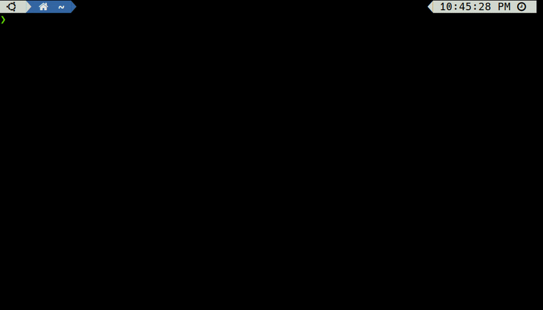

# Welcome to Connaisseur

A Kubernetes admission controller to integrate container image signature verification and trust pinning into a cluster.

## What is Connaisseur?

Connaisseur ensures integrity and provenance of container images in a Kubernetes cluster. To do so, it intercepts resource creation or update requests sent to the Kubernetes cluster, identifies all container images and verifies their signatures against pre-configured public keys. Based on the result, it either accepts or denies those requests.

Connaisseur is developed under three core values: *Security*, *Usability*, *Compatibility*. It is built to be extendable and currently aims to support the following signing solutions:

- [Notary V1](https://github.com/theupdateframework/notary) / [Docker Content Trust](https://docs.docker.com/engine/security/trust/)
- [Sigstore](https://sigstore.dev/) / [Cosign](https://github.com/sigstore/cosign) (EXPERIMENTAL)
- [Notary V2](https://github.com/notaryproject/nv2) (PLANNED)

It provides several additional features:

- [Detection Mode](features/detection_mode.md): *warn but do not block invalid images*
- [Namespaced Validation](features/namespaced_validation.md): *restrict validation to dedicated namespaces*
- [Alerting](features/alerting.md): *send alerts based on verification result*

Feel free to reach out to us via [GitHub Discussions](https://github.com/sse-secure-systems/connaisseur/discussions)!

## Quick Start

Getting started to verify image signatures is only a matter of minutes: 



> :warning: Only try this out on a test cluster as deployments with unsigned images will be blocked. :warning:

Connaisseur comes pre-configured with public keys for its own repository and [Docker's official images](https://docs.docker.com/docker-hub/official_images/) (for a list of official images check [here](https://hub.docker.com/search?q=&type=image&image_filter=official)).
It can be fully configured via `helm/values.yaml`.
For a quick start, clone the Connaisseur repository:

```bash
git clone https://github.com/sse-secure-systems/connaisseur.git
```

Next, install Connaisseur via [Helm](https://helm.sh):

```bash
helm install connaisseur helm --atomic --create-namespace --namespace connaisseur
```

Once installation has finished, you are good to go. Successful verification can be tested via official Docker images like `hello-world`:

```bash
kubectl run hello-world --image=docker.io/hello-world
```

Or our signed `testimage`:

```bash
kubectl run demo --image=docker.io/securesystemsengineering/testimage:signed
```

Both will return `pod/<name> created`. However, when trying to deploy an unsigned image:

```bash
kubectl run demo --image=docker.io/securesystemsengineering/testimage:unsigned
```

Connaisseur returns an error `(...) Unable to find signed digest (...)`. Since the images above are signed using Docker Content Trust, you can inspect the trust data using `docker trust inspect --pretty <image-name>`.

To uninstall Connaisseur use:

```bash
helm uninstall connaisseur --namespace connaisseur
```

To uninstall all components add the `--purge` flag.

Congrats :tada: you just validated the first images in your cluster! To get started configuring and verifying your own images and signatures, please follow our full [setup guide](getting_started.md).


## How does it work?

write how it works

## Compatibility

Connaisseur is assumed to be compatible with most common Kubernetes services. It has been successfully tested with:

- [K3s](https://github.com/rancher/k3s) ✅
- [kind](https://kind.sigs.k8s.io/) ✅
- [MicroK8s](https://github.com/ubuntu/microk8s) ✅
- [minikube](https://github.com/kubernetes/minikube) ✅
- [Amazon Elastic Kubernetes Service (EKS)](https://docs.aws.amazon.com/eks/) ✅
- [Azure Kubernetes Service (AKS)](https://docs.microsoft.com/en-us/azure/aks/) ✅
- [Google Kubernetes Engine](https://cloud.google.com/kubernetes-engine/docs/) ✅
- [SysEleven MetaKube](https://docs.syseleven.de/metakube) ✅


## Development

Contributing, ADRs, ...

## Resources

Several resources are available to learn more about connaisseur and related topics:

- "[*Container Image Signatures in Kubernetes*](https://medium.com/sse-blog/container-image-signatures-in-kubernetes-19264ac5d8ce)" - blog post (full introduction)
- "[*Integrity of Docker images*](https://berlin-crypto.github.io/event/dockerimagesignatures.html)" - talk at Berlin Crypto Meetup (*The Update Framework*, *Notary*, *Docker Content Trust* & Connaisseur [live demo])
- "[*Verifying Container Image Signatures from an OCI Registry in Kubernetes*](https://blog.sigstore.dev/verify-oci-container-image-signatures-in-kubernetes-33663a9ec7d8)" - blog post (experimental support of SigStore/Cosign)

