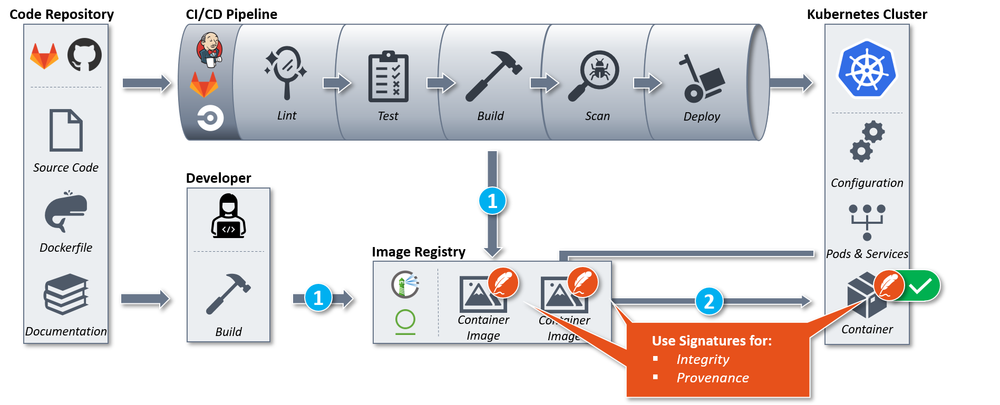
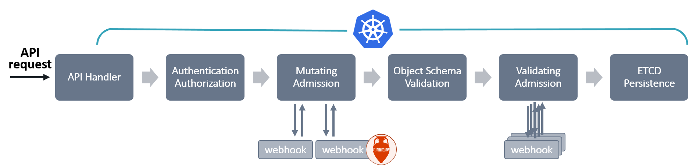

# Welcome to Connaisseur

A Kubernetes admission controller to integrate container image signature verification and trust pinning into a cluster.

## What is Connaisseur?

Connaisseur ensures integrity and provenance of container images in a Kubernetes cluster.
To do so, it intercepts resource creation or update requests sent to the Kubernetes cluster, identifies all container images and verifies their signatures against pre-configured public keys.
Based on the result, it either accepts or denies those requests.

Connaisseur is developed under three core values: *Security*, *Usability*, *Compatibility*.
It is built to be extendable and currently aims to support the following signing solutions:

- [Notary V1](https://github.com/theupdateframework/notary) / [Docker Content Trust](https://docs.docker.com/engine/security/trust/)
- [Sigstore](https://sigstore.dev/) / [Cosign](https://github.com/sigstore/cosign) (EXPERIMENTAL)
- [Notary V2](https://github.com/notaryproject/nv2) (PLANNED)

It provides several additional features:

- [Detection Mode](features/detection_mode.md): *warn but do not block invalid images*
- [Namespaced Validation](features/namespaced_validation.md): *restrict validation to dedicated namespaces*
- [Alerting](features/alerting.md): *send alerts based on verification result*

Feel free to reach out to us via [GitHub Discussions](https://github.com/sse-secure-systems/connaisseur/discussions)!

## Quick Start

Getting started to verify image signatures is only a matter of minutes: 


> :warning: Only try this out on a test cluster as deployments with unsigned images will be blocked. :warning:

Connaisseur comes pre-configured with public keys for its own repository and [Docker's official images](https://docs.docker.com/docker-hub/official_images/) (for a list of official images check [here](https://hub.docker.com/search?q=&type=image&image_filter=official)).
It can be fully configured via `helm/values.yaml`.
For a quick start, clone the Connaisseur repository:

```bash
git clone https://github.com/sse-secure-systems/connaisseur.git
```

Next, install Connaisseur via [Helm](https://helm.sh):

```bash
helm install connaisseur helm --atomic --create-namespace --namespace connaisseur
```

Once installation has finished, you are good to go.
Successful verification can be tested via official Docker images like `hello-world`:

```bash
kubectl run hello-world --image=docker.io/hello-world
```

Or our signed `testimage`:

```bash
kubectl run demo --image=docker.io/securesystemsengineering/testimage:signed
```

Both will return `pod/<name> created`. However, when trying to deploy an unsigned image:

```bash
kubectl run demo --image=docker.io/securesystemsengineering/testimage:unsigned
```

Connaisseur returns an error `(...) Unable to find signed digest (...)`. Since the images above are signed using Docker Content Trust, you can inspect the trust data using `docker trust inspect --pretty <image-name>`.

To uninstall Connaisseur use:

```bash
helm uninstall connaisseur --namespace connaisseur
```

To uninstall all components add the `--purge` flag.

Congrats :tada: you just validated the first images in your cluster!
To get started configuring and verifying your own images and signatures, please follow our full [setup guide](getting_started.md).


## How does it work?

Integrity and provenance of container images deployed to a Kubernetes cluster can be ensured via digital signatures.
On a very basic level, this requires two steps:

1. Signing container images *after building*
2. Verifying the image signatures *before deployment*

Connaisseur aims to solve step two.
This is achieved by implementing several *validators*, i.e. configurable signature verification modules for different signing schemes (e.g. Notary V1).
While the detailed security considerations mainly depend on the applied scheme, Connaisseur in general verifies the signature over the container image content against a trust anchor (e.g. public key) and thus let's you ensure that images have not been tampered with (integrity) and come from a valid source (provenance). 



### Trusted digests

But what is actually verified?
Container images can be referenced in two different ways based on their registry, repository, image name (`<registry>/<repository>/<image name>`) followed by either tag or digest:

- tag: *docker.io/library/nginx:****1.20.1***
- digest: *docker.io/library/nginx@****sha256:af9c...69ce***

While the tag is a mutable, human readable description, the digest is an immutable, inherent property of the image, namely the SHA256 hash of its content.
This also means that a tag can correspond to multiple digests whereas digests are unique for each image.
The container runtime (e.g. containerd) compares the image content against the received digest before spinning up the container (CHECK!!).
As a result, Connaisseur just needs to make sure that only *trusted digests* (signed by a trusted entity) are passed to the container runtime.
Depending on how an image for deployment is referenced, it will either attempt to translate the tag to a trusted digest or validate whether the digest is trusted.
How the digest is signed in detail, what the signature is verfied against and how different attempts to inject malicious images are mitigated depends on the signature schemes.

### Admission controllers

How to validate images *before* deployment to a cluster?
The [Kubernetes API](https://kubernetes.io/docs/concepts/overview/kubernetes-api/) is the fundamental fabric behind the control plane.
It allows operators and cluster components to communicate with each other and, for example, query, create, modify or delete Kubernetes resources.
Each request passes through several phases such as authentication and authorization before it is persisted.
Among those phases are two steps of [admission control](https://kubernetes.io/docs/reference/access-authn-authz/admission-controllers/): mutating and validating admission.
In those phases the API sends admission requests to configured webhooks (admission controllers) and receives admission responses (admit, deny, or modify).
Connaisseur uses a mutating admission webhook, as requests are not only admitted or denied based on the validation result but might also require modification of contained images referenced by tags to trusted digests.
The webhook is configured to only forward resource creation or update requests to the Connaisseur pods (SERVICE??) running inside the cluster, since only deployments of images to the cluster are relevant for signature verification.
This allows Connaisseur to intercept requests before deployment and based on the validation: 

- *admit* if all images are referenced by trusted digests (CHECK!)
- *modify* if all images can be translated to trusted digests
- *deny* if at least one of the requested images does not have a trusted digest

While validating admission controllers can only admit or deny, mutating admission controllers can also modify the request.
As Connaisseur might have to modify a request containing a container image referenced by tag to a trusted digest, it uses a mutating admission webhook which passes the request to its pods running inside the cluster.
The webhook is configured to only intercept resource creation or update requests, since only those are relevant for signature verification.



### Workflow

## Compatibility

Supported signature solutions and configuration options are documented under [Validators](./validators/README.md).

Connaisseur is expected to be compatible with most Kubernetes services. It has been successfully tested with:

- [K3s](https://github.com/rancher/k3s) ✅
- [kind](https://kind.sigs.k8s.io/) ✅
- [MicroK8s](https://github.com/ubuntu/microk8s) ✅
- [minikube](https://github.com/kubernetes/minikube) ✅
- [Amazon Elastic Kubernetes Service (EKS)](https://docs.aws.amazon.com/eks/) ✅
- [Azure Kubernetes Service (AKS)](https://docs.microsoft.com/en-us/azure/aks/) ✅
- [Google Kubernetes Engine](https://cloud.google.com/kubernetes-engine/docs/) ✅
- [SysEleven MetaKube](https://docs.syseleven.de/metakube) ✅

All registry interactions use the [OCI Distribution Specification](https://github.com/opencontainers/distribution-spec/blob/main/spec.md) that is based on the [Docker Registry HTTP API V2](https://docs.docker.com/registry/spec/api/) which is the standard for all common image registries.
For using Notary V1 as a signature solution, some registries provide the required Notary server attached to the registry with e.g. shared authentication. Connaisseur has been tested with the following Notary V1 supporting image registries:

- [Docker Hub](https://hub.docker.com/) ✅
- [Harbor](https://goharbor.io/) ✅ (check our [configuration notes](./validators/notaryv1.md#using-harbor-container-registry))
- [Azure Container Registry (ACR)](https://docs.microsoft.com/en-us/azure/container-registry/) ✅ (check our [configuration notes](./validators/notaryv1.md#using-azure-container-registry))

In case you identify any incompatibilities, please [create an issue](https://github.com/sse-secure-systems/connaisseur/issues/new/choose) :hearts:

## Development

Connaisseur is open source and open development.
We try to make major changes transparent via [*Architecture Decision Records* (ADRs)](./adr/README.md) and announce developments via [GitHub Discussions](https://github.com/sse-secure-systems/connaisseur/discussions/categories/announcements).

We hope to get as many direct contributions and insights from the community as possible to steer further development.
Please refer to our [contributing guide](CONTRIBUTING.md), [create an issue](https://github.com/sse-secure-systems/connaisseur/issues/new/choose) or [reach out to us via GitHub Discussions](https://github.com/sse-secure-systems/connaisseur/discussions) :pray:

## Resources

Several resources are available to learn more about connaisseur and related topics:

- "[*Container Image Signatures in Kubernetes*](https://medium.com/sse-blog/container-image-signatures-in-kubernetes-19264ac5d8ce)" - blog post (full introduction)
- "[*Integrity of Docker images*](https://berlin-crypto.github.io/event/dockerimagesignatures.html)" - talk at Berlin Crypto Meetup (*The Update Framework*, *Notary*, *Docker Content Trust* & Connaisseur [live demo])
- "[*Verifying Container Image Signatures from an OCI Registry in Kubernetes*](https://blog.sigstore.dev/verify-oci-container-image-signatures-in-kubernetes-33663a9ec7d8)" - blog post (experimental support of SigStore/Cosign)

